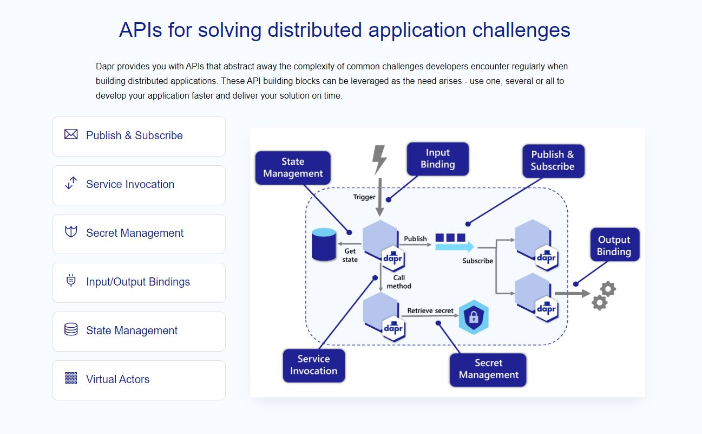
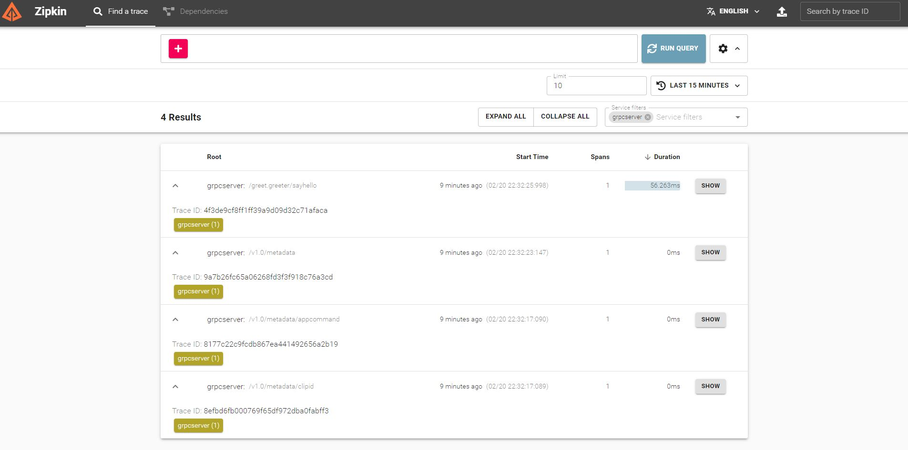
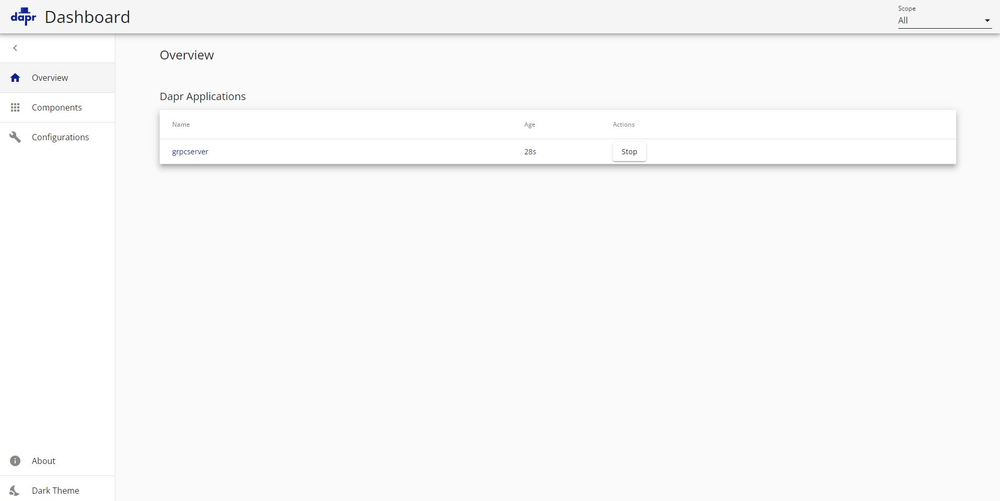

## Dapr



## Tech Stack

- [x] Dapr
- [x] Rest
- [x] StateStore
- [x] Pub/Sub
- [x] Grpc
- [x] Zipkin
- [x] Tye
- [x] Dapr Dashboard
- [] K8s [TODO]
- [] LocalStack [TODO]

```powershell
# install dapr cli
$ powershell -Command "iwr -useb https://raw.githubusercontent.com/dapr/cli/master/install/install.ps1 | iex"

# verify
$ dapr

# init cli
$ dapr init

# verify container
$ docker ps

# create sln
$ dotnet new sln -o daprdemo
```

## Rest API


```powershell
# create webapi project
# $ dotnet new angular -o daprdemo
$ dotnet new webapi -o webapi

# add to sln
$ dotnet sln add .\webapi\webapi.csproj

# add dapr service invocation
$ dotnet add .\webapi\ package Dapr.AspNetCore

# run project
$ dotnet run --project .\webapi\
http://localhost:5164/swagger/index.html

# go to project folder
$ cd webapi

# execute dapr
$ dapr run --app-id api --app-port 5164 --dapr-http-port 3500 --dapr-grpc-port 3501 -- dotnet run

```

## State store (default Redis)


```powershell

# state store (pick http port)
$ dapr run

```

## GRPC


```powershell
# grpc server
$ dotnet new grpc -o grpcserver

# add grpc server reflection
$ dotnet add .\grpcserver\ package Grpc.AspNetCore.Server.Reflection

# trust https
$ dotnet dev-certs https --trust

# grpc client
$ dotnet new console -o grpcclient

# add package to support grpc
$ dotnet add .\grpcclient\ package Grpc.Net.Client
$ dotnet add .\grpcclient\ package Google.Protobuf
$ dotnet add .\grpcclient\ package  Grpc.Tools

# add to sln
$ dotnet sln add .\grpcserver\grpcserver.csproj
$ dotnet sln add .\grpcclient\grpcclient.csproj

$ dotnet add .\webapi\ package Grpc.AspNetCore.Server.Reflection

# open docker desktop
$ docker ps

# start grpc server(cd grpcserver)
$ dapr run -a grpcserver -p 5011 -P grpc -- dotnet run

# start grpc client(cd grpcclient)
$ dapr run -a grpcclient -P grpc -- dotnet run

# invoke
http://localhost:<dapr-port>/v1.0/invoke/<application-id>/method/<method-name>

#zipkin
http://localhost:9411/zipkin

```

## Pub/Sub


```powershell

# create pubsub folder

# create components sub folder

# setup pubsub yml
$ copy C:\Users\admin\.dapr\components\pubsub.yaml .\components\

# update subscription yaml

# create pub project
$ dotnet new console -n pub

# create sub project
$ dotnet new webapi --no-https -n sub

# start sub (cd sub)
$ dapr run -a sub -p 3501 -d ..\components\ -- dotnet run --urls http://*:3501

# start pub (cd pub)
$ dapr run -a pub -p 3500 -d ..\components\ -- dotnet run
```

## Zipkin

http://localhost:9411/zipkin



## Dapr Dashboard



```powershell

$ dapr dashboard

# http
http://localhost:8080

```

## k8s [TODO]

## Localstack [TODO]

```powershell
$ docker-compose up -d
```
